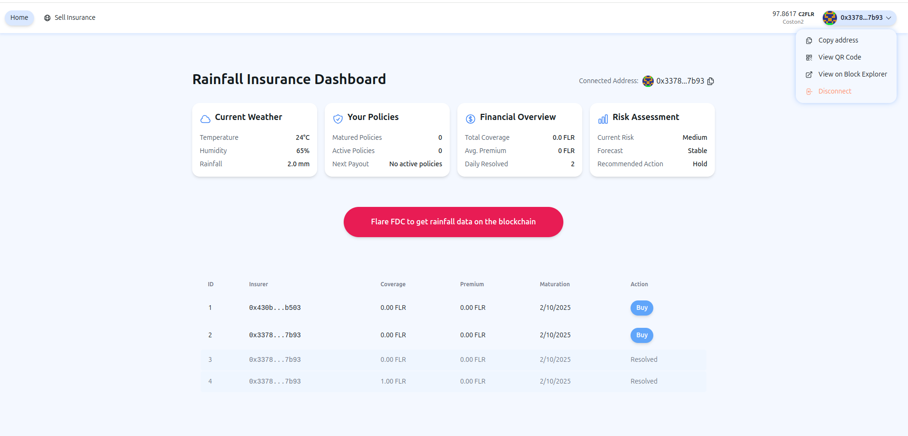
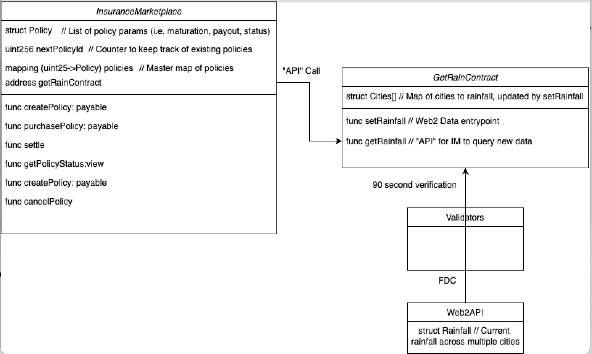
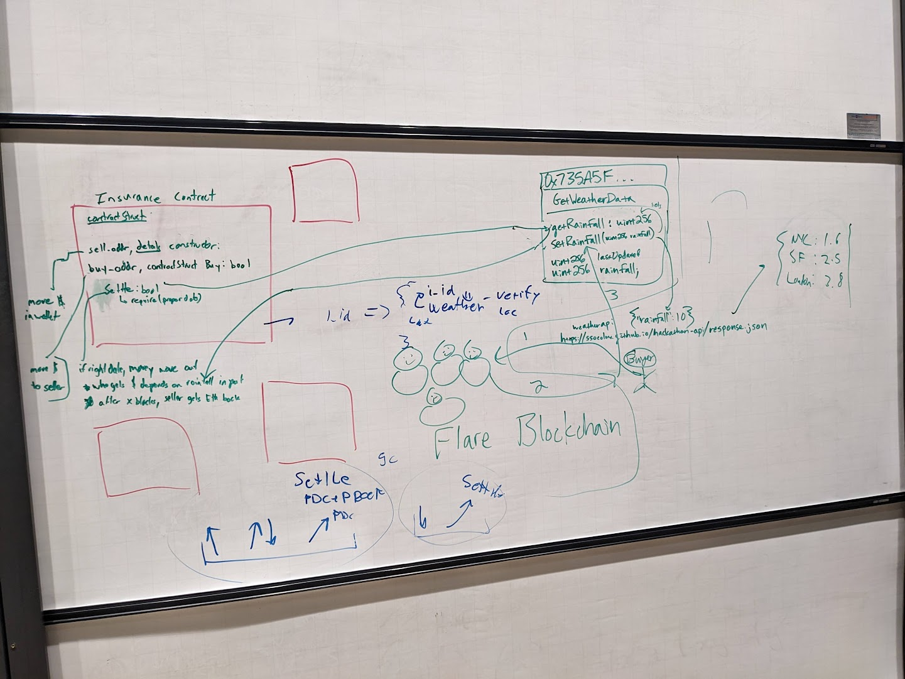

# Flareinsure - Rainfall Insurance on Flare with FDC (Flare Data Connector)

## https://flareinsure.vercel.app/

Are you a farmer worried about a drought? Or a traveler who wants to hedge against a rainy day? Then Flarinsure is for you!

We use two smart contracts:

1. An Oracle contract that interfaces with the Flare Data Connector (FDC) to get rainfall data
2. A Policy contract that allows you to buy and redeem policies  



  See our demo video here: https://www.loom.com/share/929e2d0cf44e42c8b6b8045d39f000aa?sid=a84aad35-5f57-4dc9-897b-e297c943bbab
  

## Team
Team members (from left to right):
- [Phillip](https://github.com/phillipyan300) 
- [Moncef](https://github.com/Mushrimpy)
- [Simon](https://github.com/ssocolow)


## Frontend
Repo: https://github.com/Mushrimpy/blockinsure_flare. We used React, Next.js, and Scaffold-Eth to build the frontend. The frontend FDC button calls a server running with a docker container from this repo: https://github.com/ssocolow/docker-test.

## Acknowledgements
Special thanks to Phillip and the rest of the Flare team for helping us get set up and guiding our build! Also thanks to Adam Spiers for the invaluable mentorship he provided.

## Our Flare Experience
It was really fun and interesting working with a data blockchain for the first time and creatively exploring the possibilities associated with it. It was a little difficult getting started with the JQ processor, but after a while it became a lot smoother. Overall appreciated the robustness of the FDC with its flexiblity in taking in different data sources. We realized the large scope of opportunities associated with enshrined protocols.

## Design
Final design:


Initial design:


## Forked repo info - Flare Hardhat Starter Kit

**IMPORTANT!!**
The supporting library uses Openzeppelin version `4.9.3`, be careful to use the documentation and examples from that library version.

### Getting started

If you are new to Hardhat please check the [Hardhat getting started doc](https://hardhat.org/hardhat-runner/docs/getting-started#overview)

1. Clone and install dependencies:

   ```console
   git clone https://github.com/flare-foundation/flare-hardhat-starter.git
   cd flare-hardhat-starter
   ```

   and then run:

   ```console
   yarn
   ```

   or

   ```console
   npm install
   ```

2. Set up `.env` file

   ```console
   mv .env.example .env
   ```

3. Change the `PRIVATE_KEY` in the `.env` file to yours

4. Compile the project

    ```console
    yarn hardhat compile
    ```

    or

    ```console
    npx hardhat compile
    ```

    This will compile all `.sol` files in your `/contracts` folder. It will also generate artifacts that will be needed for testing. Contracts `Imports.sol` import MockContracts and Flare related mocks, thus enabling mocking of the contracts from typescript.

5. Run Tests

    ```console
    yarn hardhat test
    ```

    or

    ```console
    npx hardhat test
    ```

6. Deploy

    Check the `hardhat.config.ts` file, where you define which networks you want to interact with. Flare mainnet & test network details are already added in that file.

    Make sure that you have added API Keys in the `.env` file

   ```console
   npx hardhat run scripts/tryDeployment.ts --network coston2
   ```

## Resources

- [Flare Developer Hub](https://dev.flare.network/)
- [Hardhat Docs](https://hardhat.org/docs)

